# SMM_Practice2
(Developed during the CS Degree) A Unity game in 2-dimensions in which a Rogue has to overcome some levels with tramps and zombies.

# Screenshots and video
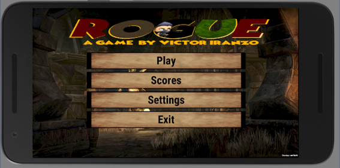
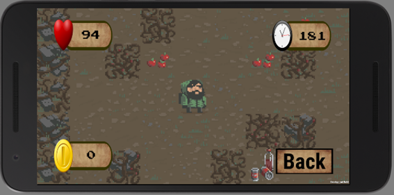
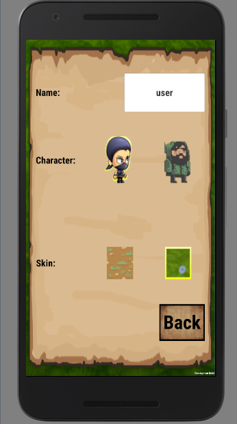
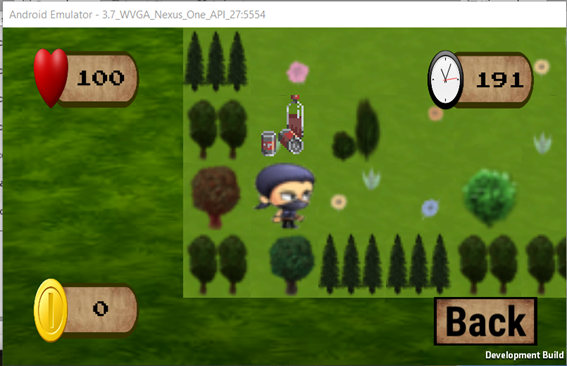

# Improvements

The game is based in a Unity tutorial and adds some improvements to the base game:

## User interface
There have been created 3 new scenes: (images provided on top)
- Menu: redirects to the rest. 
- Scores: shows the 20 highest scores. A prefab is instantiated for each of the scores restored from an xml file:

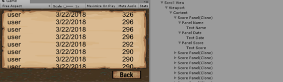

- Settings: allows to introduce the player's name and sets the skin and character of the game. The selected skin changes the board game objects in the game and the background of the menus. The selected character can be the classical one or a ninja girl. The title of the game  also changes following the settings:

## Play
Contains 4 controls in the corners of the device:
- The health, that is restarted to 100 at each level.
- The counter, that starts in 200 seconds each level and ends the game if it arrives to 0.  The decrease count is done using a coroutine:

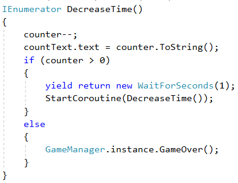

- The coins, that are computed at the end of each level in function of the remaining time and health at the end of it.

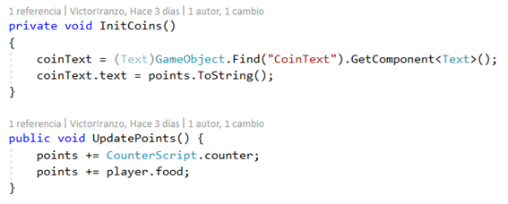

- Back button, that returns to the Menu.

## The Control
The control of the player's game is more or less the one exposed in the tutorial. In this way the game can work both in mobile and computer devices.

The control of the camera is the same for both platforms, so  the same Mathf.Lerp is applied to follow the character. Also code has been added to adapt to changes in the screen size:

However, the screen size depends on the device. In mobiles, it depends on the ration between the width and height  and a factor that multiplies it to make a better zoom to the character. The screen's orientation also is changed to be landscaped during the play.

## The art or animations
The game is configurable: a new character and skin has been added. Also some other game objects have been added.

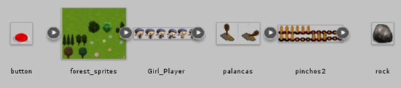

The girl player animator controller overrite the player's one, and defines its own animations with its sprites. The same happens with the tramp object, where 2 states are defined depending on if the tramp is active or not. Also note that a sound is played when the active animation of the tramp is ON thanks to an event that executes a function in a script.

About the 2 characters in the game, both exist as game objects and one is destroyed at the start of the game after reading the settings xml file:

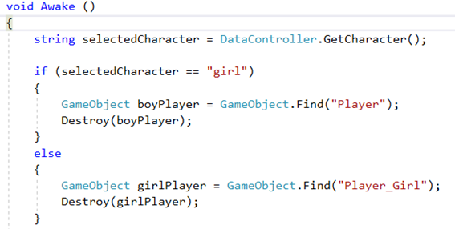

Finally, to set the skin some properties have been added to the Game Controller, so the tiles used to generate the board of the game depends on the skin selected in the settings xml file: 

## The mechanics of the game
First of all, a system has been implemented to load specific designed by a developer. This is required as a lot of  custom game objects have been added. The way of defining a level  is with a method  that returns a matrix with the representation of the level. This is an example:

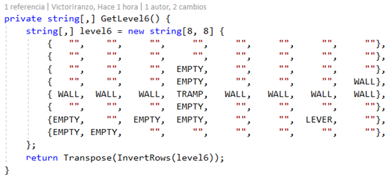

This mechanism allows us, for example, to build a labyrinth in the level 5.

As you can see, not all the level is statically generated and the empty strings in the matrix will be replaced by the algorithm of the tutorial by objects as zombies, walls, food, etc. Also note that the matrix is transformed (it's trasposed and the rows are inverted) to adjust the matrix representation to the game one. This method is then called when the board of the level (in the example, the 6th) is built. Each string is associated with a GameObject that will be instantiated from a prefab.

The game objects that have been added are the following:
- Tramp: mentioned above talking about animations. It has a box collider that is managed by another object (lever or button) and in this way, when it's active, the character cannot cross it.

- Lever: controls a tramp changing the state of its animation and adding or destroying the tramp's box collider. It also has an animation and an audio source that is played when the player collides with it.

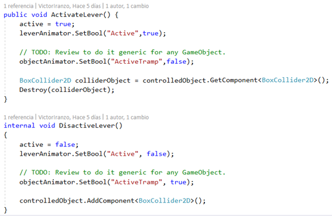

When the player tries to move to the lever's postion, he changes the state of the lever due to the collision detected.

- Rock: similar to the lever. When the player tries to move to the rock position, he pushes the rock in the same direction and he remains where he was. The rock implements the moving object abstract class to delegate in the Move method.

- Button: has a box collider trigger that changes the state of the object controlled (tramp). The trigger is launched when the player or a rock are collide with this object. While something is on its position, the tramp will be inactive.

- Black level: a huge sprite that fulls all the screen except a small circle that follows the character. It is in a layer on the top of the rest game objects to hide them. It's used in the level 10 of the game. To follow the character, the update method is used.

Other game objects as the fake levers (does nothing) or the sensors (acts as the button, when something "touches it", moves the exit to a new position) have been added too. They appear in the level 3 and 9 respectively.

## The Scores data (xml saved)
Two XML files are stored. Both are stored in the same path, but it's access is different:

- Settings XML: contains the user, skin and player's name. As they are not "entities" itself cause they are simple strings, the XmlDocument class is employed to access them:

Note that a string (character) is maintained as a cache to reduce the access to the file.

- Scores XML: the XmlSerializer class is used as it it's an "entity" and the Scores and Score class have been created. It's a clean solution that employs streams to acces the file (it's important to close them after every access).

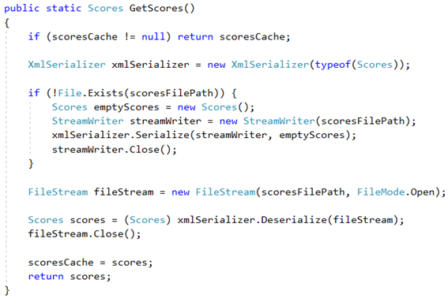

Note that when the file doesn't exist, it is created with an empty Scores object.

To instantiate the Score prefab panel shown in the Scores menu this method is used. Here a LINQ query is used to the list of score objects. The ScoreScript is a class that contains a reference to the user, date and points texts that are in the bottom of the hierarchy of each instantiated prefab. In the loop, the text of each instanitated prefab is set.